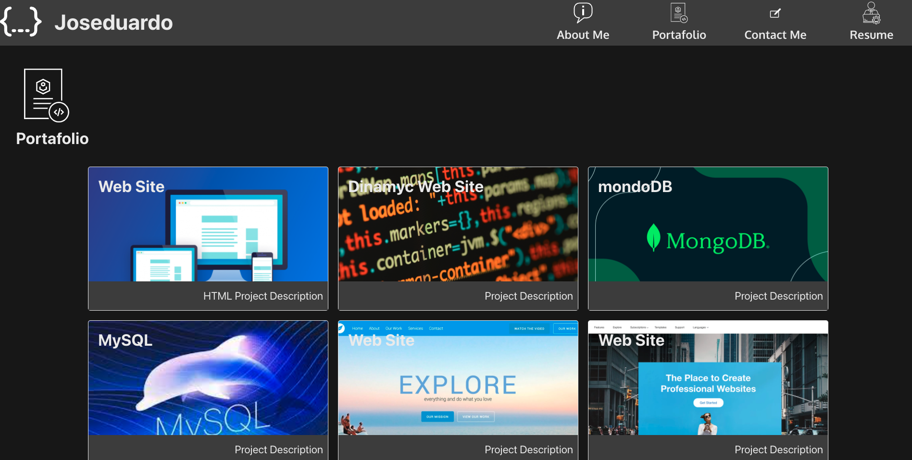

# React Portafolio

## Description

A simple react portafolio using SPA.

## Table of Contents

- [Usage](#usage)
- [Questions](#questions)
- [License](#license)

## Usage

pease visit the project live url http://joseduardo15062005.github.io/reaact-portafolio

## Contributing

You can participate in this project, submiting bugs, and feature request. Also you can help testing this project using jest.

## Questions

for any questions feel free to contact me to joseduardo15062005@gmail.com

checkout the [GitHub profile](https://github.com/joseduardo15062005)

## License

Code released under the MIT License [License](https://choosealicense.com/licenses/mit/).
for additional questions please feel free to contact us via email at joseduardo15062005@gmail.com
